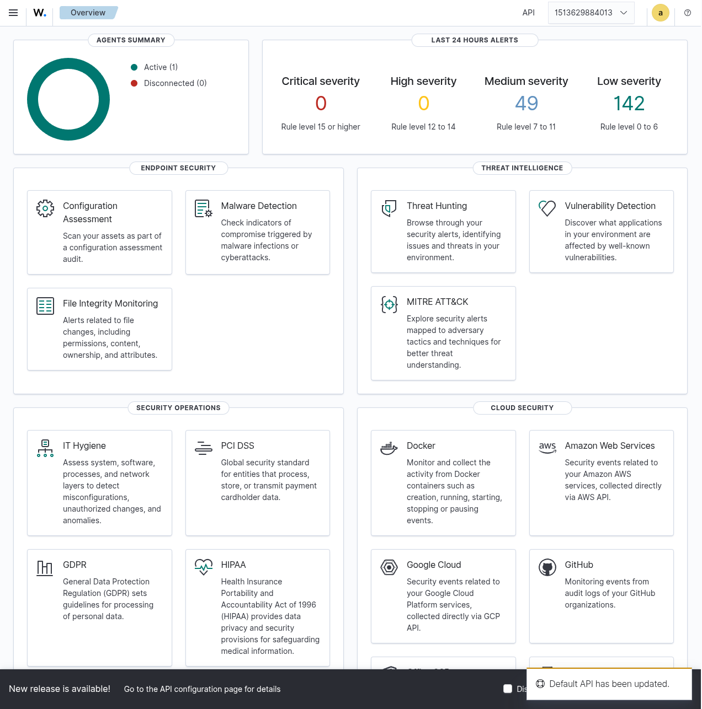

# Wazuh SIEM & XDR Deployment

This folder documents the installation, configuration, and practical application of Wazuh as an open-source SIEM and XDR (Extended Detection and Response) solution in the home lab.

---

## 📁 Contents

| File | Purpose |
|------|---------|
| [**Wazuh Setup Guide**](../Lab_Setup_Manual/wazuh_setup.md) | Step-by-step guide for Docker-based deployment of the Wazuh stack |
| [**wazuh_detection_engineering.md**](wazuh_detection_engineering.md) | Documentation of custom rule creation, decoder logic, and alerting |
| [**wazuh_local_rules.xml**](wazuh_local_rules.xml) | The actual custom XML rules implemented on the Wazuh Manager |
| [**rootkit_anomaly_detection.md**](rootkit_anomaly_detection.md) | Forensic investigation of "Trojaned" binary alerts & false positive handling |
| [**vulnerability_assessment.md**](vulnerability_assessment.md) | Analyzing agent-based vulnerability scan results and risk posture |
| [**wazuh_soar_architecture.md**](wazuh_soar_architecture.md) | **Implemented** SOAR design for automated Active Response & Discord integration |
| [**virustotal_integration_walkthrough.md**](virustotal_integration_walkthrough.md) | VirusTotal enrichment setup and walkthrough |
| [**walkthrough_anomaly_tuning.md**](walkthrough_anomaly_tuning.md) | **Education:** Step-by-step guide for anomaly investigation & SIEM tuning |
| [**wazuh_screenshot_guide.md**](wazuh_screenshot_guide.md) | Scenarios and triggers used to generate visual evidence for the portfolio |

---

## 🚀 Key Capabilities Demonstrated

- 🛡️ **Endpoint Monitoring** — Deploying Wazuh agents to Windows and Linux hosts for real-time telemetry.
- 🔍 **File Integrity Monitoring (FIM)** — Detecting unauthorized changes to critical system files and configurations.
- 🦠 **Vulnerability Detection** — Continuous scanning for CVEs and outdated software on managed endpoints.
- 🤖 **SOAR & Automation** — Custom Python integration with Discord Webhooks and automated IP blocking via Active Response.
- 🔬 **Forensic Investigation** — Using system-native tools (`pacman`, `stat`, `shadow`) to triage and validate security anomalies.
- 📊 **Log Management & Visualization** — Using the Wazuh Dashboard (OpenSearch) to visualize security events and trends.
- ✍️ **Custom Rule Development** — Writing tailored XML rules to detect specific attack patterns (e.g., brute force, suspicious shells).

---

## 🎯 Goal

The goal of this section is to showcase a scalable, host-based detection pipeline that complements the network-focused logging of Splunk, providing a comprehensive "Defense in Depth" visibility across the lab.
