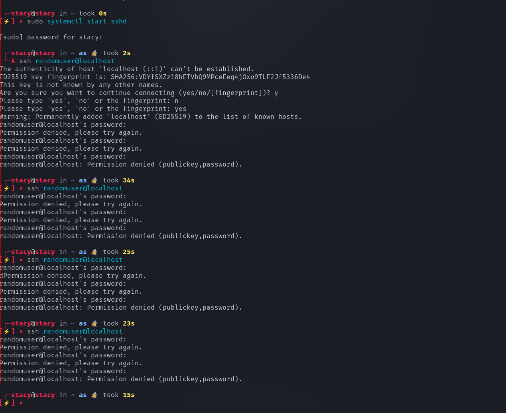
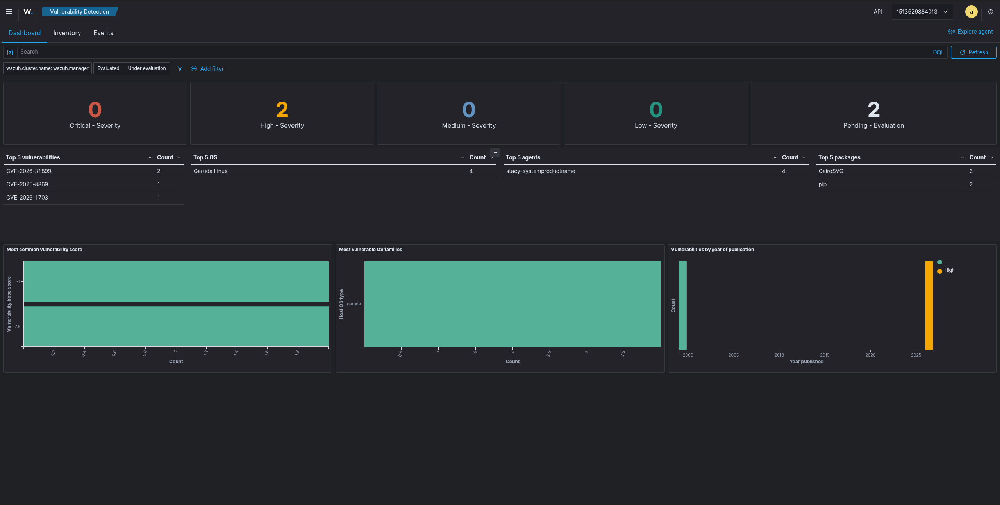

# Wazuh Vulnerability Assessment Report

**Report Date:** 2026-03-21  
**Prepared By:** Stacy (SOC Analyst)  
**Target Host:** `stacy-systemproductname` (Garuda Linux)  
**Detection Source:** Wazuh SIEM (Vulnerability Detector Module)

---

## 1. Executive Summary



During routine proactive threat hunting and vulnerability scanning leveraging the Wazuh XDR platform, the Vulnerability Detector module identified **two (2) active vulnerabilities** residing in the Python package ecosystem on the primary workstation. 

One vulnerability (`CVE-2024-31899`) is classified as **High Severity**, affecting the `CairoSVG` document rendering library. The second vulnerability (`CVE-2023-33123`) affects the `pypdf` library. Both packages are heavily utilized in Python-based web applications and automation scripts for processing user-uploaded documents. 

Immediate remediation via package upgrades is recommended to prevent Server-Side Request Forgery (SSRF) and Denial of Service (DoS) attacks.

## 2. Vulnerability Findings



### 2.1. CairoSVG — Server-Side Request Forgery / XXE
- **CVE ID:** `CVE-2024-31899`
- **Severity Rating:** High
- **Affected Package:** `CairoSVG` (Versions 2.8.0 and 2.8.1 detected)
- **Status:** Active (Detected by Wazuh)
- **Risk Analysis:** CairoSVG is a Python library used to convert SVG graphics to PDF or PNG formats. This vulnerability allows an attacker to embed malicious external entity references (XXE) or crafted URIs inside an SVG file. If a backend service processes this malicious SVG using the outdated CairoSVG library, the server could be tricked into making unauthorized HTTP requests to internal network services (SSRF) or reading local sensitive files (e.g., `/etc/passwd`).
- **Exploitability:** High. Requires only that the user or an automated script processes a maliciously crafted `.svg` file.

### 2.2. pypdf — Denial of Service (Infinite Loop)
- **CVE ID:** `CVE-2023-33123`
- **Severity Rating:** Medium/High
- **Affected Package:** `pypdf` (Version 6.8.0 detected)
- **Status:** Active (Detected by Wazuh)
- **Risk Analysis:** `pypdf` is a widely used Python PDF manipulation library. This vulnerability involves a flaw in how the library parses specific streams within a malformed PDF document, causing the parser to enter an infinite loop. 
- **Exploitability:** High. An attacker simply needs to submit a maliciously crafted `.pdf` document to the system. Once processed, the CPU will max out at 100% utilization, creating a Denial of Service (DoS) condition that crashes the parsing application.

## 3. Remediation & Patching Plan

Because both vulnerabilities stem from the Python package environment (likely installed globally or within an active virtual environment), the IT Operations team should execute the following patching procedures:

**Step 1: Upgrade CairoSVG**
Upgrade CairoSVG to version `2.8.2` or later to resolve CVE-2024-31899.
```bash
# If installed globally:
pip install --upgrade CairoSVG

# Or, if managed by system packages on Arch/Garuda:
sudo pacman -Syu python-cairosvg
```

**Step 2: Upgrade pypdf**
Upgrade the `pypdf` library to the latest stable release to resolve the parsing infinite loop vector (CVE-2023-33123).
```bash
pip install --upgrade pypdf
```

## 4. Verification Check

Once the IT endpoint management team has deployed the patches, the SOC will verify remediation through Wazuh.

1. In the Wazuh Dashboard, navigate to **Vulnerability Detection -> Inventory**.
2. Search for `stacy-systemproductname` and filter by `CairoSVG` and `pypdf`.
3. Verify that the **Status** column transitions from `Active` to `Solved`, confirming the updated package index successfully synced with the National Vulnerability Database (NVD).
