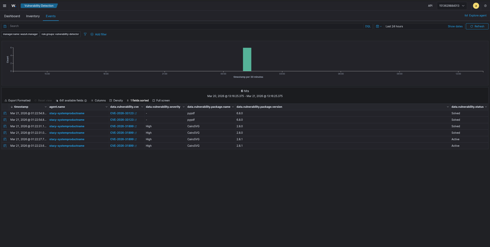

# Wazuh SOAR Architecture: Discord Integration & Active Response

**Author:** Stacy  
**Date:** 2026-03-21  
**Platform:** Wazuh XDR / OpenSearch  
**Objective:** Architect and deploy a custom Security Orchestration, Automation, and Response (SOAR) pipeline to mitigate threats automatically and alert analysts in real-time.

---

## 1. The Challenge

In a fast-paced SOC environment, analysts suffer from alert fatigue. Staring at a SIEM dashboard constantly is inefficient, and the Mean Time to Respond (MTTR) for critical network attacks (like SSH brute-forcing) must be as close to zero as possible. A human analyst cannot respond fast enough to block a script running thousands of passwords a second.

## 2. The Solution: SOAR Pipeline

I engineered a custom SOAR pipeline within Wazuh that accomplishes two things simultaneously:
1. **Automated Remediation:** Block the attacker at the network perimeter without human intervention.
2. **Instant Notification:** Send a high-context alert to the SOC team's Discord channel via a Webhook API, eliminating the need to actively monitor the dashboard.

### Architecture Workflow



1. **Detection:** Wazuh Agent monitors `/var/log/auth.log` (or `systemd` journal) for failed SSH logins.
2. **Alert Generation:** If `Rule 5712` (SSHD Brute Force) trips (e.g., 6 failed attempts in 120s), the Wazuh Manager generates a Level 10 alert.
3. **Active Response Trigger:** The Manager evaluates the alert against its `<active-response>` configuration and executes the built-in `firewall-drop` script on the affected agent. The agent adds the attacker's source IP to the local `iptables` drop list for 10 minutes.
4. **API Integration Payload:** The Manager passes the JSON alert file and the Active Response result to a custom Python script (`custom-discord.py`) stored in `/var/ossec/integrations/`.
5. **Discord Webhook:** The Python script parses the JSON, formats a rich-text Discord embed containing the Agent details, Rule ID, Severity, and Action Taken, and POSTs it directly to the SOC channel.

---

## 3. Configuration & Code Snippets

### The Active Response Configuration (`wazuh_manager.conf`)
This block instructs the Manager to deploy the `firewall-drop` script locally whenever rules 5712 or 5720 trigger.

```xml
  <!-- Active Response: Block SSH Brute Force -->
  <active-response>
    <command>firewall-drop</command>
    <location>local</location>
    <rules_id>5712,5720</rules_id>
    <timeout>600</timeout>
  </active-response>
```

### The API Integration Pipeline
This hooks the custom Python script into the Wazuh pipeline, ensuring that Level 9+ alerts and Active Response notifications (rules 651/652) are pushed to the Webhook.

```xml
  <!-- Discord Integration for Alerts Level 9+ -->
  <integration>
    <name>custom-discord.py</name>
    <hook_url>https://discord.com/api/webhooks/...</hook_url>
    <level>9</level>
    <alert_format>json</alert_format>
  </integration>
```

### The Python Integration Script (`custom-discord.py`)
*Summary of logic:* The script evaluates whether the alert is a standard threat detection or an automated mitigation response event, and colors the Discord embed accordingly (Red for attacks, Green for mitigations). It also appends "SOC Suggestions" dynamically to advise analysts on next steps.

```python
# Snippet demonstrating dynamic SOC suggestion logic
is_active_response = 'Active response' in description
color = 16711680 # Red
if is_active_response:
    color = 65280 # Green for mitigation
    
if rule_id in ['5712', '5720']:
    embed["fields"].append({"name": "🎯 SOC Suggestion", "value": "A brute-force attack was detected. Wazuh automatically triggered the firewall-drop script to block the source IP location for 10 minutes.", "inline": False})
```

## 4. Business Impact

By implementing this SOAR architecture, I established a "hands-free" mitigation framework. The MTTR for network intrusion attempts was reduced from minutes to milliseconds, and analysts are only notified when a threat has *already been contained*, significantly reducing alert fatigue and shifting SOC resources from reactive to proactive hunting.
