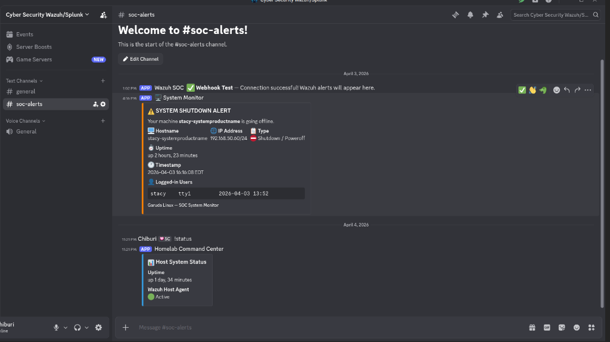
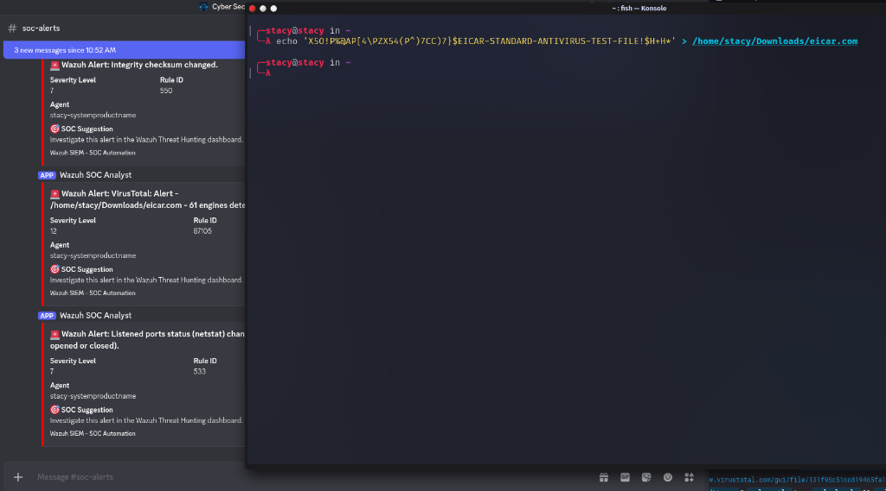

# Wazuh SOAR Architecture: Discord Integration & Active Response

**Author:** Stacy  
**Date:** 2026-04-04  
**Platform:** Wazuh XDR / OpenSearch  
**Objective:** Architect and deploy a comprehensive Security Orchestration, Automation, and Response (SOAR) pipeline to mitigate threats automatically and allow two-way interactions with the SOC team directly via Discord.

---

## 1. The Challenge

In a fast-paced SOC environment, analysts suffer from alert fatigue. Staring at a SIEM dashboard constantly is inefficient, and the Mean Time to Respond (MTTR) for critical network attacks must be as close to zero as possible. Conversely, when analysts are reviewing logs remotely, they need an accessible interface to query system health and pull alerts without needing to authenticate into the VPN/Dashboard infrastructure directly.

## 2. Phase 1: Automated Mitigation & Notification (Outbound Webhook)

I engineered a custom SOAR pipeline within Wazuh that accomplishes two things simultaneously:

1. **Automated Remediation:** Block the attacker at the network perimeter without human intervention.
2. **Instant Notification:** Send a high-context alert to the SOC team's Discord channel via a Webhook API, eliminating the need to actively monitor the dashboard.

### Architecture Workflow
1. **Detection:** Wazuh Agent monitors `/var/log/auth.log` (or `systemd-journald`) for failed SSH logins.
2. **Alert Generation:** If `Rule 5712` (SSHD Brute Force) trips, the Wazuh Manager generates a Level 10 alert.
3. **Active Response Trigger:** The Manager evaluates the alert against its `<active-response>` configuration and executes the built-in `firewall-drop` script on the affected agent.
4. **API Integration Payload:** The Manager passes the JSON alert file and the Active Response result to a custom Python script (`custom-discord.py`) stored in `/var/ossec/integrations/`.
5. **Discord Webhook:** The Python script parses the JSON, formats a rich-text Discord embed containing the Agent details, Rule ID, Severity, and Action Taken, and POSTs it directly to the SOC channel. (Red for detections, Green for automations).

---

## 3. Phase 2: Two-Way Interactive Command Center (Inbound Bot)

To enhance remote incident response capabilities, I deployed a fully persistent **Interactive Discord Bot Backend** using Python (`discord.py`). This allows SOC analysts to issue commands directly inside the Discord channel to query the Wazuh SIEM cluster live.

### Implementation Details

* **The API Gateway:** Created a discrete Application within the Discord Developer portal with Privileged Gateway Intents (Message Content) to securely read SOC commands from authorized channels.
* **The Python Daemon:** Engineered `discord_bot.py`, running in an isolated python virtual environment (`venv`) to securely map Discord commands to local system/docker routines.
* **Service Persistence:** Deployed the bot as a `systemd` daemon (`discord-bot.service`) utilizing `Restart=always` to ensure complete 24/7 endpoint availability.

**Operational Commands:**

* `!status`: Polls `uptime` and `systemctl is-active wazuh-agent` to deliver a quick health-check card of the host telemetry.
* `!services`: Executes `docker compose ps` against the Wazuh array to verify cluster/indexer topology health remotely.
* `!alerts`: Acts as a direct remote hook into `/var/ossec/logs/alerts/alerts.json` to stream the last 3 parsed critical SIEM alerts directly into Discord.

---

## 4. Phase 3: Deep Host Telemetry & Organic Event Pipeline

To guarantee the SOAR pipeline is fed the most granular data possible, I expanded the endpoint observability:
* **Systemd-Journald Integration:** Modified `ossec.conf` on the Arch-based host (Garuda) to natively siphon `journald` logs directly into Wazuh, ensuring PAM authentication failures (`sudo`, `su`) are caught immediately.
* **File Integrity Monitoring (FIM):** Activated `syscheck` on vital user directories (`~/.ssh`) with `<directories realtime="yes">`. Lowered the Discord Integrator threshold to `Level 7` to ensure FIM events (malware drops, EICAR tests) trigger the SOAR pipeline instantly organically.
* **Endpoint State Polling:** Wrote a bash script (`shutdown_discord_alert.sh`) bounded to `shutdown.target` and `reboot.target`. It evaluates the Linux Runlevel (0 vs 6) and fires a critical system-state alert to Discord *just before* the network interface is killed.

---

## 5. Phase 4: Malware Hunting with VirusTotal Integration

To transform the system from a behavioral monitor into a pro-active malware hunter, I integrated the **VirusTotal API** into the SIEM pipeline. This enables automated, real-time threat intelligence lookups on any file dropped onto the endpoint.

### Real-Time Detection Workflow

* **The "Watcher":** Configured the Wazuh Agent on the host PC to monitor the `Downloads` directory in real-time. Any arrival of a browser download or file transfer triggers the detection chain.
* **The "Evaluator":** The Wazuh Manager performs an automated hash lookup via the VirusTotal API.
* **The SOC Response:** If 1 or more AV engines flag the file as malicious, a **Level 12 Internal Alert** is generated. This instantly triggers the Discord SOAR pipeline, pushing a red alert with the VirusTotal permalink directly to the SOC channel.

---

## 6. Business Impact

By implementing this comprehensive four-phase SOAR architecture, I established a "hands-free" mitigation framework combined with chat-ops flexibility.

* The **MTTR** for network intrusion attempts and malware ingestion was reduced from minutes to milliseconds.
* The **Discord Command Center** shifted triage capabilities directly into the hands of remote analysts.
* **Zero-Trust for Files:** Every binary arriving on the system is now automatically vetted by 70+ global security vendors, ensuring malware is detected before it can execute.
* Analysts are selectively notified when serious anomalies appear or threats have been contained, significantly reducing alert fatigue and shifting SOC resources from reactive to proactive hunting.
